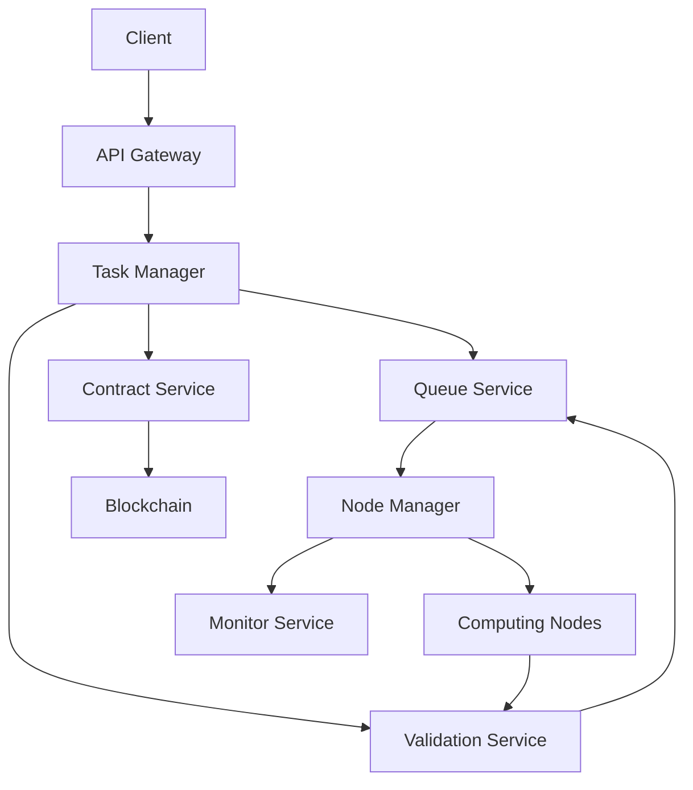

# QuantumFluxAI

<div align="center">
  

  [](LICENSE)
  [](https://github.com/zvcmumnpa5/QuantumFluxAI/stargazers)
  [](https://github.com/zvcmumnpa5/QuantumFluxAI/issues)
  [](https://github.com/zvcmumnpa5/QuantumFluxAI/actions)
  [](https://codecov.io/gh/zvcmumnpa5/QuantumFluxAI)

  <p align="center">
    <strong>Unlocking the Power of Multi-Chain AI Computing</strong>
  </p>
</div>

## Vision

QuantumFluxAI is building a decentralized AI computing ecosystem that connects AI model providers, computing resource providers, and users in a trustless, efficient, and scalable way. Our vision is to democratize access to AI computing resources while ensuring fair compensation for resource providers and maintaining high-quality service standards.

## Features

- **Decentralized Computing Network**
  - P2P node discovery and connection
  - Automatic resource allocation
  - Real-time node health monitoring
  - Dynamic task distribution

- **Smart Contract Integration**
  - Secure task registration and assignment
  - Automated payment distribution
  - Reputation system
  - Stake-based participation

- **AI Task Management**
  - Multiple model type support
  - Task queuing and prioritization
  - Result validation
  - Performance metrics tracking

- **Security & Privacy**
  - End-to-end encryption
  - Secure model deployment
  - Data privacy protection
  - Access control management

## System Architecture



## Business Model

1. **Transaction Fees**
   - Small percentage fee on completed tasks
   - Premium features for enterprise users
   - Priority queue access

2. **Staking Rewards**
   - Node operator staking requirements
   - Reward distribution for validators
   - Performance-based incentives

3. **Partnership Program**
   - AI model provider integration
   - Hardware provider collaboration
   - Enterprise solution customization

## Project Status

### Current Progress
- ✅ Core architecture design
- ✅ Smart contract implementation
- ✅ Basic service layer
- 🏗️ Node management system
- 🏗️ Task validation mechanism
- 📅 User interface (Planned)
- 📅 Testing network launch (Planned)

### Roadmap
- **Q1 2024**: Alpha testnet launch
- **Q2 2024**: Beta network with initial partners
- **Q3 2024**: Mainnet preparation
- **Q4 2024**: Public mainnet launch

## Directory Structure

```
QuantumFluxAI/
├── docs/                    # Documentation
│   ├── api/                # API documentation
│   ├── assets/             # Images and resources
│   └── guides/             # User and developer guides
├── src/
│   ├── backend/            # Backend services
│   │   ├── src/
│   │   │   ├── routes/    # API routes
│   │   │   ├── services/  # Core services
│   │   │   ├── types/     # TypeScript definitions
│   │   │   └── utils/     # Utility functions
│   ├── contracts/         # Smart contracts
│   │   ├── src/          # Contract source code
│   │   └── tests/        # Contract tests
│   └── frontend/         # Web interface
│       ├── components/   # React components
│       ├── pages/        # Application pages
│       └── utils/        # Frontend utilities
├── tests/                # Integration tests
└── config/              # Configuration files
```

## Getting Started

### Prerequisites
- Node.js >= 16
- Solana CLI tools
- Docker (optional)

### Installation
```bash
# Clone the repository
git clone https://github.com/zvcmumnpa5/QuantumFluxAI.git

# Install dependencies
cd QuantumFluxAI
npm install

# Set up environment
cp .env.example .env

# Start development server
npm run dev
```

## Contributing

We welcome contributions! Please see our [Contributing Guide](CONTRIBUTING.md) for details.

### Development Process
1. Fork the repository
2. Create a feature branch
3. Commit your changes
4. Push to your fork
5. Submit a pull request

## License

This project is licensed under the MIT License - see the [LICENSE](LICENSE) file for details.

## Contact

- Website: [quantumfluxai.io](https://quantumfluxai.io)
- Email: contact@quantumfluxai.io
- Twitter: [@QuantumFluxAI](https://twitter.com/QuantumFluxAI)
- Discord: [QuantumFluxAI Community](https://discord.gg/quantumfluxai)

## Acknowledgments

Special thanks to our contributors and partners who have helped make this project possible. 